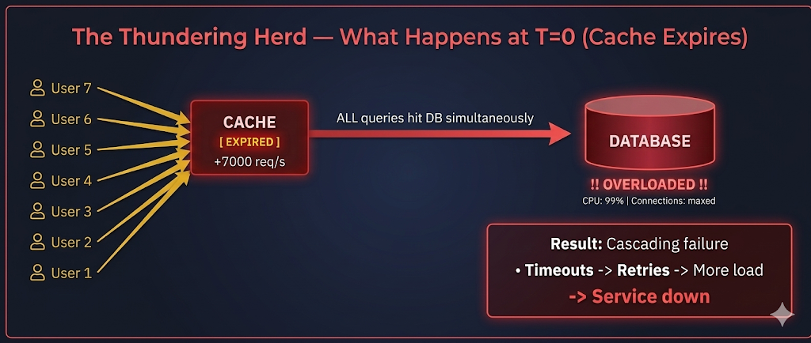
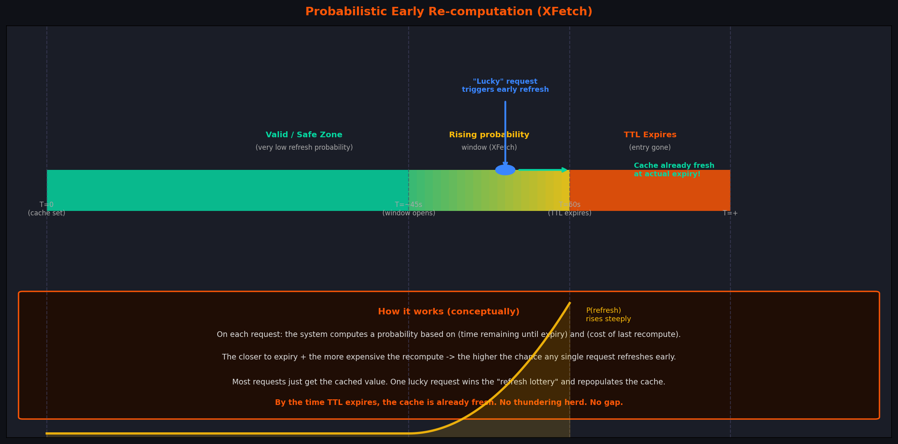
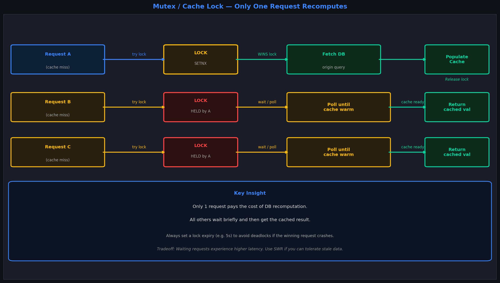
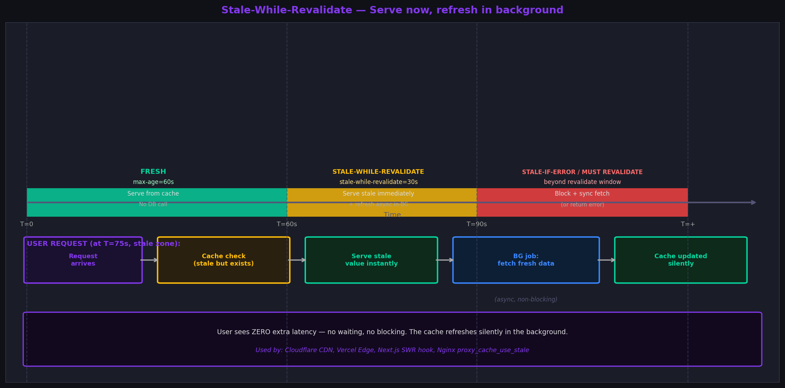
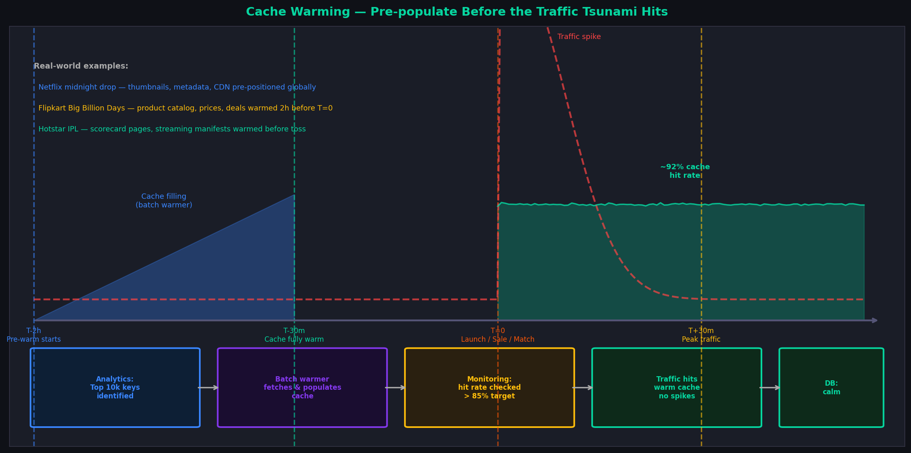
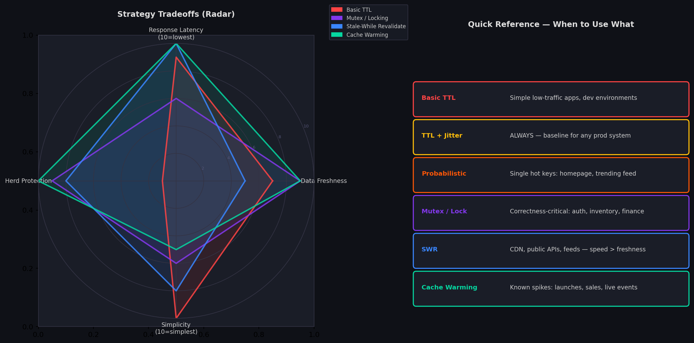

# Cache Strategies in Distributed Systems: Beyond Basic TTL

> The day your system gets popular is also the day your caching strategy gets tested. Most systems fail that test not because engineers didn't think about caching — but because they stopped thinking after setting a TTL.

I've seen this pattern enough times: a team builds something, slaps Redis on it, sets a 60-second TTL on everything, and calls it a day. It works beautifully in staging. Then the product launches, the traffic triples, and suddenly the database is screaming at 99% CPU. The cache was there. It just wasn't *designed*.

This article is about that gap — between "we have caching" and "our caching actually holds up under load." We'll go through each technique in detail, with real intuitions and real system examples. By the end, you'll have a mental model for picking the right strategy for any situation.

---

## The Problem We're Really Solving: Thundering Herd

Before we get into strategies, let's name the enemy properly. Nearly every advanced caching technique exists to solve one root problem: the **thundering herd**.

Here's the core of it: cache entries expire. When they do, requests that were previously served from cache suddenly have nothing to return. They all fall through to the database — at the same time. The database, which was comfortably serving maybe 50 queries per second from the occasional cache miss, is now getting 5,000 queries per second simultaneously.

It doesn't just slow down. It falls over. And then retries kick in, making it worse.


This isn't a theoretical problem. This is what happened to Twitter's trending topics in 2012. This is what hits e-commerce backends the second a flash sale starts. This is why Hotstar engineers lose sleep before IPL season.

Every technique we cover is, at its core, a solution to this problem.

---

## 1. Why Basic TTL Caching Is Not Enough

TTL caching is beautiful in its simplicity:

1. Request comes in. Check cache. Hit? Return it. Miss? Fetch from DB.
2. Store result in cache with an expiry time (TTL).
3. After TTL, the entry disappears. Next request fetches fresh data.

This works. For low traffic. For a handful of keys. For systems where the cost of a cache miss is trivial.

It breaks the moment you have:
- **High concurrency** — many requests hitting the same key simultaneously
- **Many keys with the same TTL** — they all expire in the same second
- **Expensive recomputation** — the DB query or API call takes 500ms+

The deeper issue is that basic TTL is **passive**. It doesn't care how many concurrent requests are waiting. It doesn't care that 10,000 users are about to simultaneously discover that a key expired. It just… expires.

### The "batch population" trap

Here's a subtle version of this problem that bites teams often. You restart your service. The cache is cold. The first wave of traffic populates cache entries — all of them — within a 2-second window. Each entry gets a 5-minute TTL. Five minutes later, every single one of those entries expires in near-unison, because they were all created at nearly the same time.

This is called **synchronized expiration**, and it's the original sin that all the techniques below try to address.

---

## 2. How Cache Expiry Causes Traffic Spikes — Synchronized TTL

Let's visualize what synchronized TTL looks like across multiple keys:


The top half shows the reality for most production systems: five important cache keys, all created around the same time (say, after a deploy), all set with the same TTL. At the 60-second mark, they all expire simultaneously. Every request for any of these keys now causes a cache miss and hits the database directly.

The bottom half shows what jitter does — the expiry events are staggered across a ~19-second window. The database sees a trickle instead of a wall.

The failure mode in the top scenario isn't just "more DB load." It's the **compounding** effect:

- Cache misses trigger DB queries
- DB queries are slow (let's say 200ms each)
- While those queries are in flight, *more* requests for the same key come in and also miss
- They also fire DB queries
- By the time the first query returns, 50 queries for the same data are in flight
- Your connection pool exhausts
- Everything starts timing out
- Retries kick in, doubling the load
- Game over

---

## 3. TTL Jitter — Adding Randomness to Expiration

The fix is almost insultingly simple: **don't let all your keys expire at the same time**.

Add a small random offset — a **jitter** — to every TTL you set. Instead of:

```
ttl = 3600
cache.set(key, value, ttl)
```

You do:

```
base_ttl = 3600
jitter    = random(0, 300)   # anywhere from 0 to 5 minutes
cache.set(key, value, base_ttl + jitter)
```

Key A expires at 3612 seconds. Key B at 3847. Key C at 3721. They're spread out. The database never gets the synchronized barrage.

**Why is this not the default behavior?** Honestly, it should be. Every caching library and framework should add jitter automatically. The fact that they don't is a legacy of "we'll add that later" turning into "everyone who needed it built it themselves."

**How much jitter to add?** A common rule of thumb: jitter of 10–20% of base TTL works well for most cases. If your base TTL is 1 hour, add random(0, 360 seconds). If it's 5 minutes, add random(0, 60 seconds).

**The edge case jitter doesn't fully solve:** A single extremely hot key — think the homepage for an e-commerce site, or the score endpoint during an IPL match. That's one key. Jitter applies between keys. A single key can still expire and cause a burst. That's where the next two techniques come in.

---

## 4. Probability-Based Early Expiration (Probabilistic Early Recomputation)

This one is clever. The idea: instead of waiting for a key to fully expire and *then* scrambling to recompute it, **proactively recompute it before it expires** — but using probability to avoid triggering this on every single request.

It was formalized as the **XFetch algorithm** in a 2015 paper, but the intuition is simple:



Picture a relay race. The current runner (your cached value) is still running fine. But as they approach the end of their lap, the next runner starts getting into position. The handoff happens mid-stride — no gap, no stumble.

With naive TTL, the first runner collapses at the finish line. Everyone stands still while a new runner warms up from a cold start.

**How the probability works (conceptually):**

On each request, the system asks: "How close are we to expiry? How long did the last recompute take?" These two factors feed a probability function. When the answer is "we're close to expiry AND recomputation is expensive," the probability of triggering an early refresh climbs steeply.

For 90% of the key's lifetime, the probability is near-zero — requests just get the cached value. As expiry approaches, the probability climbs. Eventually, one request "wins the lottery" and triggers a background refresh while still returning the current cached value. By the time the key actually expires, the cache is already fresh.

**Key insight:** The more expensive the recompute, the *earlier* the algorithm starts the refresh window. This is intentional — it gives expensive operations more time to complete before the key actually dies.

**Where this shines:**
- High-traffic single keys: trending feeds, homepage carousels, live scoreboards
- When data freshness matters but you can't afford the burst of expiry
- Systems where recomputation time is significant and variable

---

## 5. Mutex / Cache Locking — One Request Pays the Price

Jitter and probabilistic expiry handle the "keys expiring in sync" and "single hot key" cases respectively. But there's another scenario: a **cold start** — a brand-new key that has never been cached, suddenly getting hammered by concurrent requests.

Say your product launches. The homepage URL was never cached (fresh deploy, empty Redis). A million users load the page in the first minute. All of them miss the cache. All of them fire a DB query. That's not a thundering herd — that's a stampede.

**Mutex locking** solves this with one rule: **when a cache miss happens, only one request is allowed to recompute the value**. Everyone else waits or gets a stale answer.



Here's the mechanics:

1. Request A hits a cache miss. It tries to acquire a **distributed lock** (e.g., `SETNX lock:homepage 1 EX 5` in Redis — "set if not exists, expire in 5 seconds").
2. `SETNX` succeeds — Request A holds the lock. It goes to the DB, fetches data, stores it in cache, then releases the lock.
3. Requests B, C, D also hit cache misses. They also try `SETNX`. They fail — the lock is taken.
4. B, C, D poll until the lock is released and the cache is warm. They then get the cached value.

**The critical detail: always set a lock expiry.** If Request A crashes mid-flight, you don't want that lock held forever. A 5-second TTL on the lock ensures that even in a crash scenario, the system recovers.

**The tradeoff nobody talks about:** Waiting requests experience higher latency. If the DB query takes 800ms, all waiting requests also wait 800ms. For a high-traffic system, this can be acceptable. For a latency-sensitive product, this is where SWR (next section) becomes more attractive.

**A note on "dog-pile" vs "stampede":**
These terms are sometimes used interchangeably, but they're subtly different. A stampede is cold-start misses hitting the DB simultaneously. A dog-pile specifically refers to many requests piling on the same lock, queuing up. Mutex solves both.

---

## 6. Stale-While-Revalidate (SWR) — Serve Now, Fix Later

What if you could eliminate the waiting entirely? What if, instead of blocking requests while the cache refreshes, you serve the stale value and refresh in the background?

That's **Stale-While-Revalidate**, and it's one of the most practically impactful caching strategies in modern systems.



The timeline has three zones:

- **Fresh zone (0 to max-age):** Cache is current. Serve directly. No DB call.
- **Stale-while-revalidate zone (max-age to max-age + revalidate window):** Cache is technically expired, but instead of blocking the user, serve the stale value *immediately*. Simultaneously, kick off an async background fetch to refresh the cache.
- **Must-revalidate zone (beyond revalidate window):** The data is too old to serve even stale. Block and fetch fresh — or return an error.

**The CDN connection:** This is literally the behavior specified in the HTTP `Cache-Control` header:

```
Cache-Control: max-age=60, stale-while-revalidate=30
```

Cloudflare, Fastly, Vercel Edge, and nginx all implement this. When you see a response that's 61 seconds old being served from a CDN — that's SWR in action. The CDN is already fetching a fresh copy in the background.

**The frontend SWR library:** The popular `swr` npm package that Next.js developers know is named exactly after this pattern. When you call `useSWR('/api/profile')`, it immediately returns the cached (possibly stale) data, then re-fetches in the background and updates the UI when fresh data arrives. The user sees content instantly, not a loading spinner.

**When SWR is the right call:**
- Public content: news feeds, product listings, leaderboards
- User-facing data that doesn't need to be perfectly real-time: follower counts, view counts, recommendation feeds
- CDN and edge layers where you control `Cache-Control` headers

**When SWR will get you in trouble:**
- Financial data: stock prices, wallet balances, payment status — serving stale here is a bug
- Auth and session state: a stale "user is authenticated" response after a logout is a security hole
- Inventory counts during flash sales: showing "5 left" when there are 0 is a customer service disaster
- Any data where correctness at the moment of display is a hard requirement

---

## 7. Cache Warming / Pre-Warming — Fill the Pool Before the Race Starts

All the strategies above are **reactive** — they deal with cache misses as they happen. Cache warming is **proactive** — you eliminate the miss entirely by pre-populating the cache before traffic arrives.



**The Netflix midnight example (and why it's a good model):**

When Netflix drops a new season at midnight, they're not hoping the first million users fill the caches organically. Hours before the release:

- Thumbnail images are pre-cached at edge nodes globally
- Episode metadata (titles, descriptions, runtime, cast) is populated in application caches
- Recommendation model outputs for the new title are pre-computed and stored
- CDN nodes are seeded with the first few seconds of video manifest data

When midnight hits, those million users get instant responses because the data is already there — not because the first user was fast enough to populate the cache before the second user arrived.

**The IPL streaming spike:**

Hotstar's team knows exactly when a match starts. In the 30 minutes before the toss, they pre-warm:
- Team lineup and player data pages
- Scorecard templates
- Streaming manifest URLs for different bitrate variants
- Pre-match ads and sponsor data

By the time the toss happens and millions of users open the app, the cache is warm. The database barely notices.

**The e-commerce flash sale:**

For Flipkart's Big Billion Days or Amazon Prime Day, the cache warming strategy is data-driven:
1. Analytics tells you the top 10,000 most-viewed products from the past 30 days
2. You warm those product pages, pricing data, and inventory snapshots into cache 2 hours before the sale
3. You monitor hit rates — if you're not at 85%+ before T=0, something's wrong
4. You scale horizontally and verify cache cluster health

**What "warming" actually involves:**
- A batch job (or crawler) that iterates your most important keys and fires real queries
- Seeding based on historical analytics — not random, not alphabetical — ranked by expected traffic
- Verifying cache fill rates before the event starts
- Having a rollback plan: if cache warming fails, what's your DB scaling headroom?

**The hidden benefit:** Warming also surfaces bugs. If your batch warmer fails to populate 30% of keys due to a serialization bug, you find that out at 10pm — not at midnight when users are watching.

---

## 8. Two Things Most Writeups Won't Tell You

### Cache Stampede at the Write Layer

Most discussions focus on read-side cache misses. But write-through cache invalidation can also cause stampedes. When a product's price changes and you invalidate the cache key, every request that arrives in the next 500ms before the recompute completes sees a miss. For a key with 10,000 req/s, that's 5,000 simultaneous DB reads in half a second.

The fix: **write-behind invalidation with grace period**. Instead of immediately deleting the key, mark it as "stale" (leave the value, set a flag). Readers still get the value while a single background worker refreshes it. Only delete after the new value is ready.

### Cache Key Versioning in Distributed Caches

When you run multiple cache nodes (Redis cluster, Memcached), consistent hashing routes the same key to the same node — that's fine. But under failover conditions, a node disappearing can cause **cascading misses** across all keys that were hashed to that node.

Large systems handle this with **versioned keys**: `product:12345:v3` instead of just `product:12345`. When you need a global invalidation, you increment the version number. Old keys die naturally via TTL; you never have to do a mass delete. Every read that doesn't find `v3` automatically populates it — and `v2` reads in flight complete without interfering. This is called **cache versioning** or **namespace versioning**, and it eliminates entire categories of invalidation bugs.

---

## 9. Tradeoffs: Freshness, Latency, and Consistency

Here's the honest picture — every strategy forces a tradeoff across at least three dimensions:

**Freshness** — How recent is the data the user sees?  
**Latency** — How fast does the user get a response?  
**Thundering herd protection** — How well does it hold under concurrent load?  
**Implementation complexity** — How hard is it to build and operate?



Reading this: Basic TTL scores well on simplicity but catastrophically fails on herd protection. SWR scores excellently on latency and herd protection but sacrifices freshness. Mutex scores best on correctness but adds latency for waiting requests. Cache warming scores best overall — but only when you know spikes are coming.

No strategy dominates all dimensions. The right choice always depends on what your product can and cannot tolerate.

---

## 10. When to Use Which Strategy

**TTL + Jitter:** Use this always, as your baseline. There is essentially no downside. It should be the default in any caching layer you build.

**Probabilistic Early Expiration:** Use this for your hottest single keys — homepage feed, trending content, live event data. The ones where even a 2-second gap causes visible user impact. Pair it with background workers rather than inline recomputation.

**Mutex / Cache Locking:** Use this when correctness matters more than latency. Auth flows, inventory checks, user balance reads. Accept that some requests will wait — that's the deal you're making.

**Stale-While-Revalidate:** Use this at your CDN and API gateway layer. Use it for any content where "slightly old" is acceptable. Avoid it for anything where stale data causes incorrect behavior — not just suboptimal UX, but *wrong* behavior.

**Cache Warming:** Use this for any predictable traffic event. Product launches, marketing campaigns, sports seasons, sale events. Make it a checklist item in your deployment runbook.

**Layered approach (production reality):** Real systems don't pick one. They stack them:

```
All cache keys         →  TTL + Jitter (baseline)
CDN / edge layer       →  Stale-While-Revalidate
Hot keys               →  Probabilistic Early Expiration
Correctness-critical   →  Mutex Locking
Before known events    →  Cache Warming
```

This isn't over-engineering — it's defense in depth. Each layer catches a failure case the layer above it would miss.

---

## Putting It Together: A Decision Framework

When you're designing a caching system, run through these questions:

**1. Can any cache miss cause a thundering herd?**
If yes — are many keys expiring together? Add jitter. Always.

**2. Is there a single hot key that causes disproportionate damage if it expires?**
If yes — consider probabilistic early expiration or a background refresh worker pinned to that key.

**3. Is correctness at the moment of response critical?**
If yes — mutex. Accept the latency tradeoff. Never serve stale data for auth, payments, or inventory.

**4. Is latency more important than perfect freshness?**
If yes — SWR. Serve stale, refresh in background. Get product alignment that data may lag 30 seconds.

**5. Do you know when traffic will spike?**
If yes — build a warming pipeline. Treat it as a deployment artifact, not an afterthought.

**6. Are you running a distributed cache cluster?**
If yes — use versioned cache keys and design graceful degradation from cache to DB deliberately, not as an accident.

---

## Final Thoughts

Caching is one of those topics where the first 20% of knowledge gets you 80% of the way — and the last 20% is where production systems actually live. Basic TTL will work for a long time. Until it won't.

The thundering herd problem is particularly insidious because it hides in testing. You'll never see it in staging with 5 users. You'll see it the moment you matter — during the launch, during the sale, during the moment your product finally gets the traffic it deserves.

The strategies in this article aren't exotic. Netflix uses them. Hotstar uses them. Shopify uses them. The patterns are documented, the libraries exist, the tooling is mature. The only thing standing between a production outage and a smooth launch is knowing which problem each tool solves — and reaching for the right one before the spike arrives.

---


