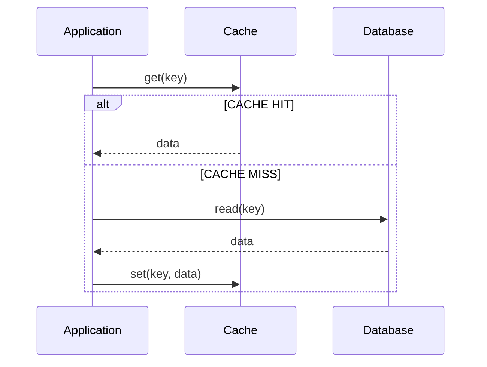
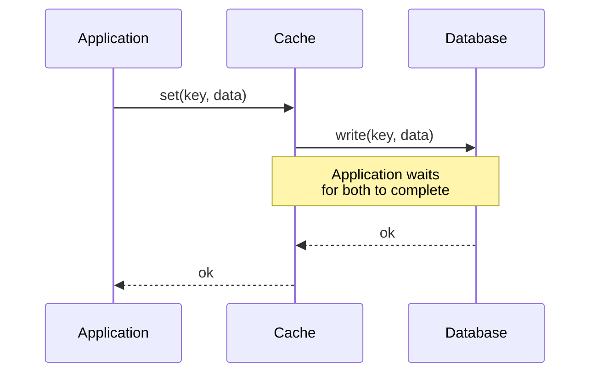
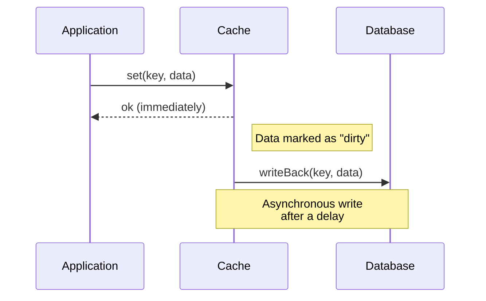

***<========== IMP Points ============>***

caching Invalidation
caching evication

***Cache-Aside and Write-Through Caching and Write-back Caching***
**Cache-Aside Caching**

Of course! Here is a comparison of Cache-Aside, Write-Through, and Write-Back caching techniques in a tabular format.

### Quick Summary

*   **Cache-Aside (Lazy Loading):** The application manages the cache. Data is loaded *on-demand* only when a cache miss occurs.
*   **Write-Through:** Data is written to both the cache and the database *simultaneously*.
*   **Write-Back (Write-Behind):** Data is written only to the cache initially. The cache then *asynchronously* writes the data to the database after a delay.

### Comparison Table

| Feature | Cache-Aside (Lazy Loading) | Write-Through | Write-Back (Write-Behind) |
| :--- | :--- | :--- | :--- |
| **Core Principle** | The cache is a sidekick. The application logic explicitly loads data into the cache on a miss. | The cache is the primary gatekeeper for reads and writes. All writes go through it to the database. | The cache is the primary destination for writes. The database update is deferred and batched. |
| **Read Workflow** | 1. Check cache. 2. If **hit**, return data. 3. If **miss**, read from DB, write to cache, then return data. | 1. Check cache. 2. If **hit**, return data. 3. If **miss**, the pattern typically **does not** handle this directly (often combined with Cache-Aside). | 1. Check cache. 2. If **hit**, return data. 3. If **miss**, read from DB, write to cache, then return data. |
| **Write Workflow** | 1. Write data directly to the database. 2. **Invalidate** the corresponding cache entry. | 1. Write data to the cache. 2. **Immediately and synchronously** write the same data to the database. | 1. Write data only to the cache. 2. Mark the data as "dirty". 3. **Asynchronously** write dirty data to the database after a delay or under certain conditions. |
| **Performance (Reads)** | **Excellent** for read-heavy workloads after cache is warmed up. Slow on initial misses. | **Excellent** for read-heavy workloads, as data is always in cache (for written data). | **Excellent**, similar to Write-Through. |
| **Performance (Writes)** | **Fast**, because writes are only to the database. | **Slower**, because every write must endure the latency of the database write. | **Fastest**, as the application doesn't wait for the database write. |
| **Data Consistency** | **Eventual Consistency.** A short window of inconsistency exists between DB write and cache invalidation. | **Strong Consistency.** The cache and database are always in sync for written data. | **Weak/Eventual Consistency.** Data in the database is stale until the cache writes it back. Risk of data loss. |
| **Complexity** | **Simple.** Application logic is straightforward. | **Moderate.** The caching layer or application logic must handle dual writes. | **Complex.** Requires a robust mechanism to track "dirty" entries and flush them to the DB. |
| **Risk of Data Loss** | **Low.** Data is persisted directly to the durable database. | **Low.** Data is immediately persisted to the database. | **High.** If the cache crashes before writing back, any dirty data is lost forever. |
| **Best Use Cases** | **Read-heavy workloads** where data isn't updated frequently (e.g., user profiles, product catalogs, news articles). | **Mixed workloads** where data consistency is critical and write latency is acceptable (e.g., banking systems, user preferences). | **Write-heavy workloads** where performance is critical and some data loss is acceptable (e.g., telemetry data, clickstream analytics, activity logs). |

---

### Visual Workflow

#### 1. Cache-Aside (Read)

#### 2. Write-Through (Write)

#### 3. Write-Back (Write)

Cache Miss: When data is requested, the application first checks the cache. If the data is not found (a cache miss), the application retrieves the data from the database.
Cache Fill: After retrieving the data from the database, the application stores a copy in the cache for future requests.
Subsequent Requests: For subsequent requests, the data is served from the cache, avoiding the need to query the database.
On-Demand Loading: Only the data that is requested is cached, which can save memory and storage.
Flexible Cache Expiration: Developers can implement custom logic for cache expiration and invalidation.
Read-Heavy Workloads: Ideal for applications with frequent reads but infrequent writes.
Dynamic Data: Suitable for data that changes regularly but not too frequently, allowing the cache to remain relevant for a reasonable period.
**Write-Through Caching**
Write Operation: When data is written or updated, it is written to both the cache and the database simultaneously.
Read Operation: Subsequent read requests can be served directly from the cache, as it is guaranteed to be consistent with the database.
Data Consistency: Ensures that the cache is always consistent with the database.
Simplified Cache Management: Simplifies the logic needed to keep the cache up-to-date.
Write-Heavy Workloads: Suitable for applications with frequent writes, ensuring the cache stays updated.
Critical Data Consistency: Ideal for systems where cache consistency with the database is critical.