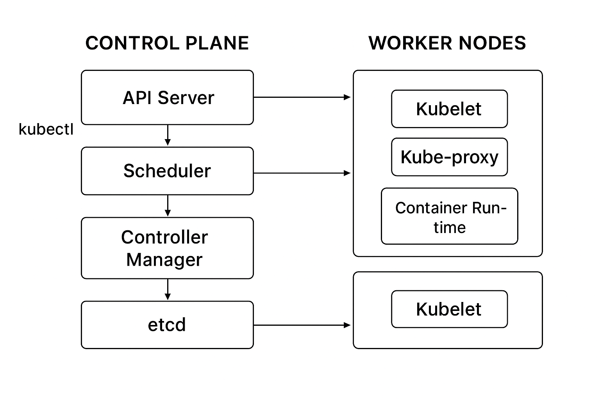

Let's discuss kubernetes . I don't know anything about it let's have a discussion about kubernetes teach me the basics in interactive way .

Perfect! Let’s start your Kubernetes journey in a friendly, hands-on, interactive way. First, here’s a simple question to get a sense of your baseline:

### Q1: Have you ever worked with **Docker** or **containers** before?

Choose one:

* A) Yes, I’ve used Docker to build or run containers.
* B) I’ve heard of Docker but haven’t used it.
* C) I don’t know what Docker or containers are.

Let me know your answer, and I’ll guide you accordingly!

***<--------------------B--------------------------------->***

Got it — you’ve heard of Docker but haven’t really used it.

Before we talk Kubernetes, we need to get **what containers are** crystal clear, because Kubernetes is basically a giant orchestra conductor for containers.

---

### Step 1: What is a Container?

Think of a container as a **small, self-contained box** that has:

1. **Your application code** (e.g., a Python API, Node.js service, etc.)
2. **All the libraries it needs** (so it runs the same everywhere)
3. **A minimal OS layer** (just enough to run the app, not a full OS like Windows)

Why this is great:

* You **don’t care** what’s installed on the host machine.
* It runs **the same** on your laptop, your friend’s computer, or a cloud server.

---

💡 **Analogy:**
If you have a food truck, the recipe, ingredients, and kitchen tools are all inside it.
You can park it anywhere and serve food without worrying about the local kitchen setup.
That’s a container.

---

**Mini Checkpoint Question:**
If containers solve the “it works on my machine” problem by packaging everything together,
why might we still need Kubernetes?
What do you think?


***<-----------------------------------I guess me might need to manage these  containers (basically orchestrate it). from your example you have van (container) with all tools to cook food but at what time and what place I should put the truck to maximise profit or may be first check the places and make sure you are authorized to park the van then park it according to places to maximize your profit.--------------------------------------------->***

Exactly! 🎯
You nailed the intuition — **Kubernetes is the city planner + logistics manager for your food trucks (containers).**

---

Let’s extend your analogy:

* **Docker** = builds and runs a single food truck.
* **Kubernetes (K8s)** = manages a *fleet* of food trucks:

  * Decides **where to park them** (scheduling containers on servers)
  * **Scales up/down** the number of trucks based on demand
  * **Checks their health** (if one breaks, it replaces it)
  * **Handles traffic** so customers are evenly served
  * **Rolls out updates** without stopping service

---

### Step 2: Why Kubernetes exists

Before Kubernetes, people ran containers manually or with simple scripts. That’s fine for 2–3 containers.
But if you have **hundreds or thousands**, across many servers, manual management becomes chaos.

Kubernetes automates:

1. **Deployment** – launching containers on the right machines
2. **Scaling** – adjusting the number of containers automatically
3. **Healing** – restarting crashed containers
4. **Networking** – making sure containers talk to each other securely
5. **Rolling updates** – updating code without downtime

---

💡 **Fun fact**: Kubernetes was originally created by Google (inspired by their internal system “Borg”) and is now open-source.

---

**Quick Question:**
Do you want me to next explain **how Kubernetes is structured** (its main components) before we run an example?
Because knowing the roles (like “Master” and “Worker”) makes the magic clearer.


***<---------------------------------Yes I am very much interested on the inner workings of k8s--------------------------------------------->***

Great! Let’s pop the hood on Kubernetes and see what’s inside.

Think of Kubernetes as a **control tower** for container planes 🚀✈️.
It has **two main parts**:

* **Control Plane** (the brains — makes decisions)
* **Worker Nodes** (the muscle — run your containers)

---

## **1. Control Plane (The Boss)**

Runs on one or more special machines. Main parts:

1. **API Server**

   * The *front desk* of Kubernetes.
   * You (or `kubectl` CLI) send all requests here.
   * Only talks in Kubernetes’ own language (YAML/JSON).

2. **Scheduler**

   * Decides **which node** will run a new container.
   * Looks at available CPU, memory, and rules.

3. **Controller Manager**

   * The **robot supervisor**.
   * Watches everything, and if reality doesn’t match the desired state, it fixes it.
     Example: You say “I want 5 containers running.” If one crashes, the controller starts a new one.

4. **etcd**

   * The **brain’s memory** (a key-value store).
   * Stores the *entire* Kubernetes cluster state — what’s running, where, configs, etc.
   * If you lose `etcd`, you lose your cluster’s memory.

---

## **2. Worker Nodes (The Workers)**

These are servers (VMs or physical) that actually run your containers.

1. **Kubelet**

   * The *node manager*.
   * Talks to the control plane: “Got it, I’ll run this container” and makes sure it’s healthy.

2. **Kube-proxy**

   * Handles networking inside the node.
   * Makes sure services can talk to each other.

3. **Container Runtime**

   * Runs the containers.
   * Could be Docker, containerd, CRI-O, etc.

---

📌 **Flow of a Deployment**

1. You run `kubectl apply -f app.yaml` (API call to API Server).
2. API Server saves desired state to `etcd`.
3. Scheduler picks a worker node.
4. Kubelet on that node starts the container.
5. Controller Manager keeps watching and correcting.

---

If you want, I can draw you a **simple diagram** showing how API Server, Scheduler, Kubelet, etc. talk to each other. That makes the workflow much easier to visualize.

Do you want me to go ahead and make that diagram?


***<--------------------yes please---------------------------------->***



***<------------------------Can you give me an example flow !! Let's suppose you are creating a project and deploying using k*s---------------->***

Alright — let’s walk through a **real-world Kubernetes deployment flow** from scratch, step by step, like we’re actually building and shipping a project.

---

## **Scenario:**

We’re building a **Python FastAPI backend** for a chatbot and want to deploy it on Kubernetes.

---

### **1. Build your application**

* Write your FastAPI app (`main.py`).
* Test it locally.

Example:

```python
# main.py
from fastapi import FastAPI

app = FastAPI()

@app.get("/")
def root():
    return {"message": "Hello from Kubernetes!"}
```

---

### **2. Containerize it**

* Create a `Dockerfile` so it can run in a container.

```dockerfile
FROM python:3.11-slim
WORKDIR /app
COPY requirements.txt .
RUN pip install -r requirements.txt
COPY . .
CMD ["uvicorn", "main:app", "--host", "0.0.0.0", "--port", "8000"]
```

* Build & push the image to a registry (Docker Hub, GitHub Container Registry, etc.):

```bash
docker build -t myusername/chatbot-api:v1 .
docker push myusername/chatbot-api:v1
```

---

### **3. Write Kubernetes manifests**

We need **two main objects**:

1. **Deployment** – tells K8s what app to run, how many replicas, and what image.
2. **Service** – exposes it internally or externally.

**`deployment.yaml`**

```yaml
apiVersion: apps/v1
kind: Deployment
metadata:
  name: chatbot-api
spec:
  replicas: 3
  selector:
    matchLabels:
      app: chatbot-api
  template:
    metadata:
      labels:
        app: chatbot-api
    spec:
      containers:
        - name: chatbot-api
          image: myusername/chatbot-api:v1
          ports:
            - containerPort: 8000
```

**`service.yaml`**

```yaml
apiVersion: v1
kind: Service
metadata:
  name: chatbot-api-service
spec:
  type: LoadBalancer
  selector:
    app: chatbot-api
  ports:
    - port: 80
      targetPort: 8000
```

---

### **4. Deploy to Kubernetes**

* Apply manifests to the cluster:

```bash
kubectl apply -f deployment.yaml
kubectl apply -f service.yaml
```

---

### **5. What happens inside Kubernetes**

1. **You run `kubectl apply`** → API Server receives request.
2. **etcd** stores: “We need a Deployment with 3 replicas of chatbot-api.”
3. **Scheduler** picks 3 worker nodes to run the Pods.
4. **Kubelet** on each chosen node pulls the Docker image from the registry.
5. Containers start, Kube-proxy ensures networking works.
6. Service gets an external IP (via LoadBalancer), customers can reach it.

---

### **6. Scaling or Updating**

* Want 5 replicas?

```bash
kubectl scale deployment chatbot-api --replicas=5
```

* Want to deploy `v2`?

```bash
kubectl set image deployment/chatbot-api chatbot-api=myusername/chatbot-api:v2
```

Kubernetes will roll it out with **zero downtime**.

---

If you want, I can now **trace this exact example with the diagram** we saw earlier so you see which Kubernetes component acts at each stage. That makes it click even more.

Do you want me to walk through it that way?


***<------------------what is pod ? and let's say my code is running on some contianer runtime but it want to consume some api from outside how could it do so ? and what about it want's to communicate to another api hosted on other continaer . how exactly ip address and stuff works ------------------------>***


Alright, let’s unpack that step-by-step — because **Pods**, **networking**, and **IP addresses** are where Kubernetes starts feeling like magic.

---

## **1. What is a Pod?**

* A **Pod** is the **smallest deployable unit in Kubernetes**.
* It’s **not** just a container — it’s a wrapper *around* one or more containers that share:

  * **Networking** (same IP address & port space)
  * **Storage** (can mount the same volumes)

💡 Usually, **one Pod = one container**.
Sometimes you have multiple containers in a pod if they’re tightly coupled (like a main app + a sidecar for logging).

---

## **2. Networking basics in K8s**

Kubernetes has **three main networking rules** (Cluster Networking Model):

1. **Every Pod gets its own unique IP address**

   * IPs are allocated by the cluster’s network plugin (like Calico, Flannel, Cilium).
   * Pods don’t share IP addresses — they’re isolated from each other by default.

2. **Pods can talk to each other directly** (no NAT)

   * No matter which node they’re on, they can use that IP directly.

3. **Pods can talk to the outside world**

   * Outbound traffic goes through the node’s network interface.

---

## **3. Case 1: Pod calling an external API**

Imagine your chatbot pod wants to hit the OpenAI API:

* Your code just does:

```python
requests.get("https://api.openai.com/v1/...")
```

* The pod sends packets to that internet address.
* Kubernetes routes that outbound traffic through the **node’s network stack** and out to the internet.
* No special configuration needed (unless your cluster blocks egress).

---

## **4. Case 2: Pod talking to another Pod**

This is where **Services** come in.

### Why we need them:

* Pod IPs are **ephemeral** — if a pod dies and restarts, it gets a new IP.
* You can’t hardcode IPs in your app.

### How it works:

1. You define a **Service** (type: `ClusterIP` for internal comms).
2. That service gets:

   * A **stable virtual IP** (VIP) inside the cluster
   * A **DNS name** (like `orders-service.default.svc.cluster.local`)
3. Your pod calls the service by name:

```python
requests.get("http://orders-service:8000")
```

4. **kube-proxy** load-balances the request to one of the pods behind the service.

---

## **5. Quick networking flow**

Example:
📦 **Pod A** (chatbot) → 📦 **Pod B** (orders API)

* Pod A sends HTTP request to `orders-service:8000`
* DNS in the cluster resolves it to the service’s cluster IP
* kube-proxy forwards it to one of Pod B’s IPs
* Pod B replies directly to Pod A (because pods have routable IPs)

---

So in short:

* **External API calls** → Go through the node’s network to the internet.
* **Internal API calls** → Go through a Kubernetes **Service** for stability & load balancing.

---

If you want, I can draw a **network diagram** showing:

* Pod IPs
* Service IP
* External API flow
  … so you can visualize this in one picture.

Do you want me to do that?


***<---------------------so 1 node will have one pod or one container ?---------------------------------------------->***

Not necessarily — that’s a **common beginner assumption**, but in reality:

* **One Node can run MANY Pods**
* **One Pod can run ONE or MORE Containers** (but usually just one)

---

### Think of it like this:

* **Node** = a physical/virtual machine in the cluster (like an EC2 instance in AWS)
* **Pod** = a small “package” that runs your container(s)
* **Container** = your app itself

📌 **Hierarchy:**

```
Cluster
 ├── Node 1
 │    ├── Pod A (Container: chatbot)
 │    ├── Pod B (Container: orders-api)
 │    └── Pod C (Container: db-sidecar, Container: db-main)
 ├── Node 2
 │    ├── Pod D (Container: recommendation-engine)
 │    └── Pod E (Container: payment-service)
 ...
```

---

### Why multiple Pods per Node?

* Nodes have CPU & RAM resources — Kubernetes schedules as many Pods as can fit.
* Example:

  * Node with 8 CPU & 16GB RAM
  * Each pod needs 1 CPU & 2GB RAM
  * → You can run 8 pods on that node.

---

### Why multiple containers per Pod?

* Only when they must share the same **network namespace** & **storage volumes**.
* Common example:

  * Main app container
  * Sidecar container for logging, monitoring, or proxying traffic

---

✅ **Key takeaway:**
Kubernetes scheduling is **flexible** — it packs multiple Pods into each Node like a game of Tetris, based on resource requests.

---

If you want, I can next show **how Kubernetes decides which Pod goes to which Node** (the scheduling logic).
That’s where the Scheduler’s “brains” really shine.
