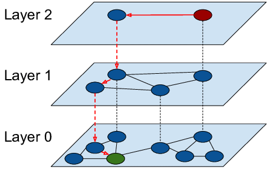

Absolutely! Let's dig into **HNSW (Hierarchical Navigable Small World)** — one of the most **powerful and intuitive** indexing methods for **approximate nearest neighbor (ANN)** search in high-dimensional vector databases like FAISS, Qdrant, and Weaviate.

---

## 🔍 What is HNSW?

**HNSW** stands for **Hierarchical Navigable Small World** graph.

It’s a **graph-based index structure** designed to efficiently search for the **nearest neighbors** of a query vector in **high-dimensional spaces** (where traditional trees like KD-Tree fail).

### 🧠 Core Idea (Intuition):

Imagine all your vectors as **cities on a map**, and HNSW builds a **multi-level road network**:

* Higher levels have **long highways** that connect distant areas.
* Lower levels have **local roads** that connect nearby neighbors.
* You **start at the top** (zoomed out view), quickly reach the rough area,
* Then you **zoom in** (lower levels) to **find the closest neighbors**.

---

## 📏 Similarity Metric

Vectors are compared using:

* **Euclidean distance** (L2 norm)

  $$
  d(x, y) = \sqrt{\sum_{i=1}^{D} (x_i - y_i)^2}
  $$
* or **Cosine similarity**

  $$
  \cos(\theta) = \frac{x \cdot y}{\|x\| \|y\|}
  $$

Both work; cosine is more common for text, L2 for image/search.

---

## 🧱 HNSW Structure

1. **Graph of Nodes**: Each node = a vector. Edges connect to nearby vectors.
2. **Multiple Layers**:

   * Top layer has few nodes and long links (fast traversal).
   * Each lower layer increases density (local refinement).
3. **Each node has a level `l ∈ [0, L]`** — assigned probabilistically:

   $$
   P(\text{level} \geq l) = e^{-\lambda l}
   $$

   (Exponential decay — most nodes stay in lower layers)

---

## 🔄 Algorithm Breakdown

### 🏗️ Index Construction

1. **Assign level** to new point:

   $$
   l \sim \text{Geometric}(\lambda) \quad \text{(e.g., λ = 1 / log(M))}
   $$
2. **Insert from top layer**:

   * Start at highest level `L`
   * Traverse to the closest neighbor using a **greedy search**:

     * At each node, jump to the neighbor closest to the new point.
   * Descend layer by layer.
3. **In each layer**, add the point and connect it to its **M nearest neighbors**.

---

### 🔎 Search Procedure

Let’s say you’re searching for a vector `q`:

1. Start at a random node at **top level**.
2. Use **greedy search** to move to the node closest to `q` in that level.

   * This means if a neighbor is closer to `q`, jump there.
3. Go down one level and repeat.
4. At the **bottom layer (level 0)**:

   * Perform **local search** using a **priority queue** and a small **beam width (ef)**.

The `ef` parameter (exploration factor) controls search breadth:

* Higher `ef` → more accuracy (but slower)
* Lower `ef` → faster, less accurate

---

## ⚖️ Trade-Offs and Parameters

| Parameter        | Description                                                    | Trade-off                                 |
| ---------------- | -------------------------------------------------------------- | ----------------------------------------- |
| `M`              | Max neighbors per node                                         | Higher = better recall, more memory       |
| `efConstruction` | Controls how many candidates are considered during index build | Higher = better graph, slower build       |
| `ef`             | Controls how many candidates are explored during search        | Higher = better recall, slower query time |

---

## 📊 Complexity

* **Insert**: $O(\log N)$ per level, total insert: $O(M \cdot \log N)$
* **Search**: $O(\log N)$ expected
* **Space**: Linear in `N` but multiplied by `M` edges/node

---

## ✨ Intuition Recap

| Layer  | Analogy     | Purpose                          |
| ------ | ----------- | -------------------------------- |
| Top    | Highways    | Quickly traverse large distances |
| Middle | Interstates | Refine position                  |
| Bottom | Local roads | Find exact neighbors             |

Instead of **brute-force comparing with all nodes**, you:

* Jump across the graph to close areas.
* Use local exploration to find best matches.

---

## 🧪 Example

Let’s say you have 1 million sentence embeddings and want to search:

* Without HNSW: O(N) brute force = slow
* With HNSW:

  * Start at top (say, node 7234)
  * Jump to 1023 → 450 → 189 → (best match path)
  * By only visiting \~100-500 nodes, you get \~95–99% accurate nearest neighbors

---

## 📦 Used in:

* **FAISS**: Facebook AI similarity search
* **Qdrant**, **Weaviate**, **Pinecone**
* **NMSLIB**, **Annoy** (alternative methods)

---

Would you like a **Python demo** using FAISS or a **graph illustration** of HNSW to help visualize it?

Excellent — let’s now walk through the **insert operation in HNSW** step-by-step, in **fine detail**, with math and intuitive explanations.

---

## 🧱 Insert Operation in HNSW (Step-by-Step)

### Overview

When inserting a new vector `q`:

1. Assign it a **random level**.
2. Starting from the **highest level**, **navigate** through the graph to find the approximate nearest neighbor.
3. **Repeat this search down to level 0** (bottom level).
4. **Connect** the new vector to its **closest neighbors** in each level using a controlled number of edges.

---

## 🔢 Step 1: Assign a Level (Hierarchy)

HNSW builds a **multi-layer graph**, and each node exists in `0 ≤ l ≤ L_max` layers.

The level for each new node is assigned randomly using an **exponential distribution**:

$$
P(\text{level} \geq l) = e^{-\lambda \cdot l}
$$

### Intuition:

* Most nodes are placed only in **lower levels**.
* Very **few nodes reach higher levels** — creating a hierarchical structure.
* Typical formula used:

  $$
  l = \lfloor -\log(U) \cdot mL \rfloor
  $$

  Where:

  * `U ∼ Uniform(0,1)`
  * `mL` is a scaling factor (e.g., `1 / ln(M)`)

---

## 👣 Step 2: Search from Top to Bottom

Let’s say the assigned level is `l = 3`.

Start from the **entry point node** (initial node or a central hub) at **level L\_max**, and move down level by level:

### At Each Level `L`, Do:

* **Greedy Search**:

  1. Compute distance between `q` and current node `c`.
  2. For each neighbor of `c`:

     * If any neighbor is **closer** to `q`, move to that neighbor.
  3. Repeat until **no closer neighbor is found**.
* This returns the **closest node** to `q` at that level.

Repeat until you reach **level 0**.

---

## 🤝 Step 3: Connect the New Node

Now you’re at level 0. Here’s how the node gets integrated into the graph:

### At Each Level `l ≤ q.level`:

1. **Do a local search** starting from the closest node found at that level.
2. Use a **priority queue** to maintain top candidates.
3. Use parameter `efConstruction` (exploration factor) to limit search scope.
4. Find top `M` **nearest neighbors** to `q` at that level.
5. Connect `q` to these `M` nodes.

### Edge Pruning:

* If more than `M` candidates are found, apply **heuristic pruning**:

  * Pick those that are **most diverse** and **evenly distributed** in vector space to avoid clustering.

### Optional:

* The neighbors of `q` may also add `q` as a reverse edge to maintain **bidirectionality** (depending on implementation).

---

## 🧠 Why This Works

The idea is:

* Higher levels = **sparse, long-range links** → fast traversal.
* Lower levels = **dense, short-range links** → precise local connections.
* By inserting through **greedy + local connection**, HNSW builds a **"navigable small-world graph"**, where you can reach any node in `O(log N)` hops.

---

## ⌛ Complexity of Insert

Let:

* `N` = total vectors
* `M` = max neighbors per node
* `efConstruction` = search width

Then:

* **Time**: $O(M \cdot \log N)$
* **Space**: $O(N \cdot M)$

---

## Example Summary (Insert "Vector X")

Let’s say you want to insert `"Vector X"`:

1. Randomly assign `level = 2`.
2. Start at top-level (say level 3), do greedy descent:

   * Node A → Node B → Node C → ...
3. At level 2:

   * Search nearby nodes (using `efConstruction = 200`)
   * Find top `M=16` closest nodes
   * Connect `"Vector X"` to these 16 nodes.
4. Repeat the same for level 1 and level 0.
5. Done — now `"Vector X"` is embedded in the graph.

---

## Key Parameters Recap

| Parameter        | Role                                                 |
| ---------------- | ---------------------------------------------------- |
| `M`              | Max neighbors per node (graph degree)                |
| `efConstruction` | Search width during insert — higher = better quality |
| `level`          | Hierarchical layer of the node                       |
| `distance_func`  | L2 or cosine (defines similarity)                    |

---

Would you like to **see a Python simulation** of inserting a vector using `faiss` or a **visual diagram** of the graph insertion process?

