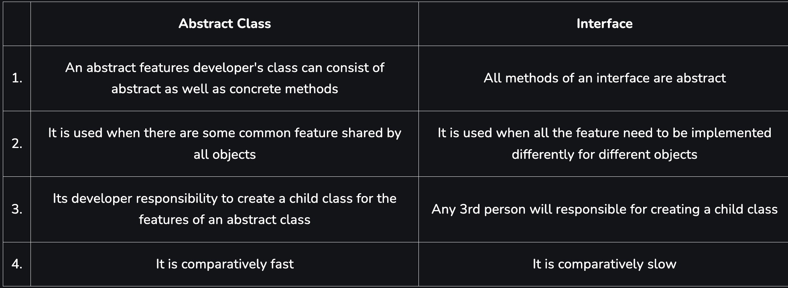

Difference between abstract class and interface in Python
Last Updated : 23 Jul, 2025
In this article, we are going to see the difference between abstract classes and interface in Python, Below are the points that are discussed in this article:

What is an abstract class in Python?
What is an interface in Python?
Difference between abstract class and interface in Python
What is an Abstract class in Python?
A blueprint for other classes might be thought of as an abstract class. You may use it to define a collection of methods that are required for all subclasses derived from the abstract class. An abstract class is one that includes one or more abstract methods. A method that has a declaration but no implementation is said to be abstract. We use an abstract class for creating huge functional units. An abstract class is used to offer a standard interface for various implementations of a component.

Example:

Python does not come with any abstract classes by default. Python has a module called ABC that serves as the foundation for building Abstract Base Classes (ABC). ABC works by decorating methods of the base class as abstract and then registering concrete classes as implementations of the abstract base. When a method is decorated with the keyword @abstractmethod, it becomes abstract.
```
python
from abc import ABC, abstractmethod
class Animal(ABC):

    def move(self):
        pass

class Human(Animal):

    def move(self):
        print("I can walk and run")

class Snake(Animal):

    def move(self):
        print("I can crawl")

class Dog(Animal):

    def move(self):
        print("I can bark")

class Lion(Animal):

    def move(self):
        print("I can roar")
        
# Driver code
R = Human()
R.move()

K = Snake()
K.move()

R = Dog()
R.move()

K = Lion()
K.move()

```

Output:
```
I can walk and run
I can crawl
I can bark
I can roar
```
What is an Interface in Python?
The interface in object-oriented languages like Python is a set of method signatures that the implementing class is expected to provide. Writing ordered code and achieving abstraction are both possible through interface implementation.

Example:

Python "object interfaces" are implemented in the module zope.interface.  It is maintained by the Zope Toolkit project. Two objects, "Interface" and "Attribute," are directly exported by the package. Several helper methods are also exported by it. Compared to Python's built-in abc module, it strives to give stronger semantics and better error messages.

Declaring interface: In Python, an interface is defined using Python class statements and is a subclass of interface.Interface which is the parent interface for all interfaces.


```
import zope.interface


class MyInterface(zope.interface.Interface):
    x = zope.interface.Attribute("foo")
    def method1(self, x):
        pass
    def method2(self):
        pass
    
print(type(MyInterface))
print(MyInterface.__module__)
print(MyInterface.__name__)

# get attribute
x = MyInterface['x']
print(x)
print(type(x))
```

Output:
```
An abstract
```
Implementing interface: The interface acts as a blueprint for designing classes, so interfaces are implemented using the implementer decorator on the class. If a class implements an interface, then the instances of the class provide the interface. Objects can provide interfaces directly, in addition to what their classes implement.

```
Syntax:  @zope.interface.implementer(*interfaces)
class Class_name:
   # methods

```

```
import zope.interface
  
  
class MyInterface(zope.interface.Interface):
    x = zope.interface.Attribute("foo")
    def method1(self, x):
        pass
    def method2(self):
        pass
  
@zope.interface.implementer(MyInterface)
class MyClass:
    def method1(self, x):
        return x**2
    def method2(self):
        return "foo"
    
obj1 = MyClass()

print(obj1.method1(5))
print(obj1.method2())
```

Output:

We declared that MyClass implements MyInterface. This means that instances of MyClass provide MyInterface.
```
25
foo
```
Difference between abstract class and interface in Python?

