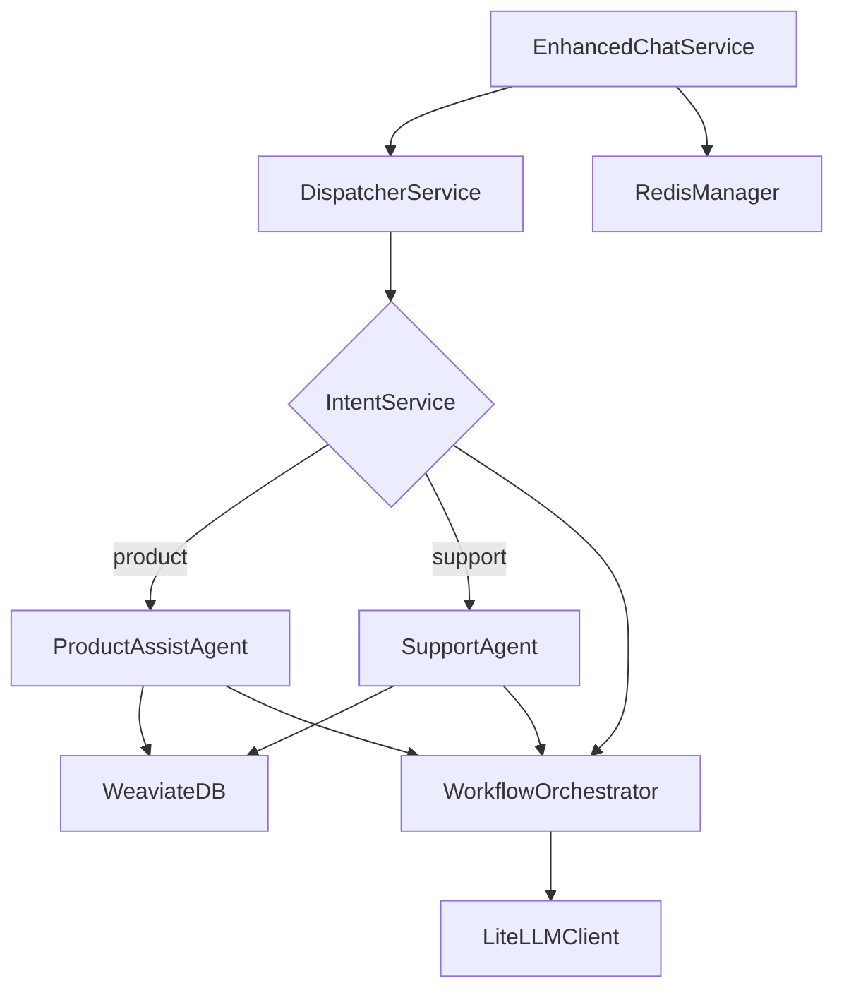

# Chat System Component Flowchart (Basic)

```mermaid
flowchart TD
    A[EnhancedChatService] --> B[DispatcherService]
    B --> C{IntentService}
    C -->|product| D[ProductAssistAgent]
    C -->|support| E[SupportAgent]
    D & E --> F[WeaviateDB]
    C & D & E --> G[WorkflowOrchestrator]
    G --> H[LiteLLMClient]
    A --> I[RedisManager]
```