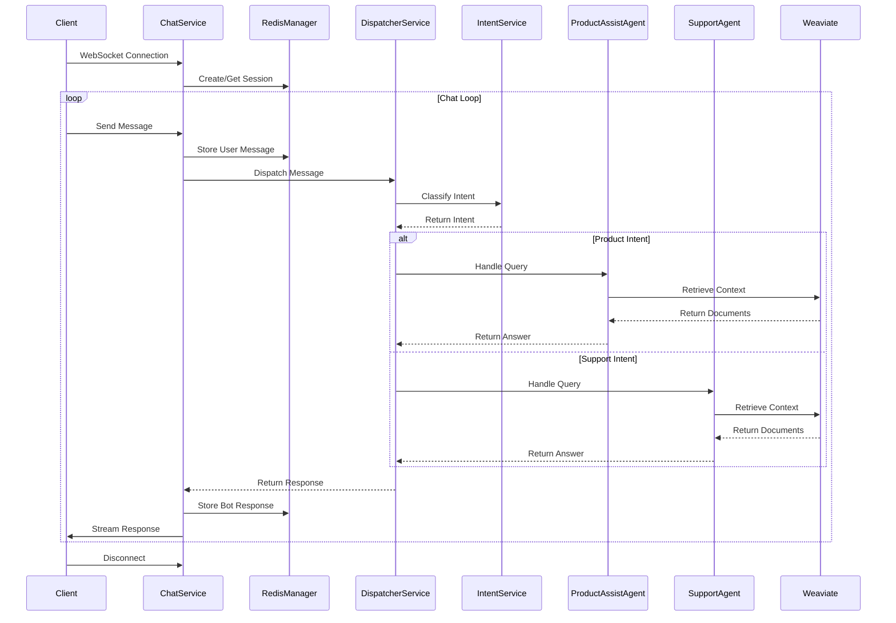

# Chat System Sequence Diagram

```mermaid
sequenceDiagram
    participant Client
    participant ChatService
    participant RedisManager
    participant DispatcherService
    participant IntentService
    participant ProductAssistAgent
    participant SupportAgent
    participant Weaviate

    Client->>ChatService: WebSocket Connection
    ChatService->>RedisManager: Create/Get Session
    loop Chat Loop
        Client->>ChatService: Send Message
        ChatService->>RedisManager: Store User Message
        ChatService->>DispatcherService: Dispatch Message
        DispatcherService->>IntentService: Classify Intent
        IntentService-->>DispatcherService: Return Intent
        alt Product Intent
            DispatcherService->>ProductAssistAgent: Handle Query
            ProductAssistAgent->>Weaviate: Retrieve Context
            Weaviate-->>ProductAssistAgent: Return Documents
            ProductAssistAgent-->>DispatcherService: Return Answer
        else Support Intent
            DispatcherService->>SupportAgent: Handle Query
            SupportAgent->>Weaviate: Retrieve Context
            Weaviate-->>SupportAgent: Return Documents
            SupportAgent-->>DispatcherService: Return Answer
        end
        DispatcherService-->>ChatService: Return Response
        ChatService->>RedisManager: Store Bot Response
        ChatService->>Client: Stream Response
    end
    Client->>ChatService: Disconnect
```
