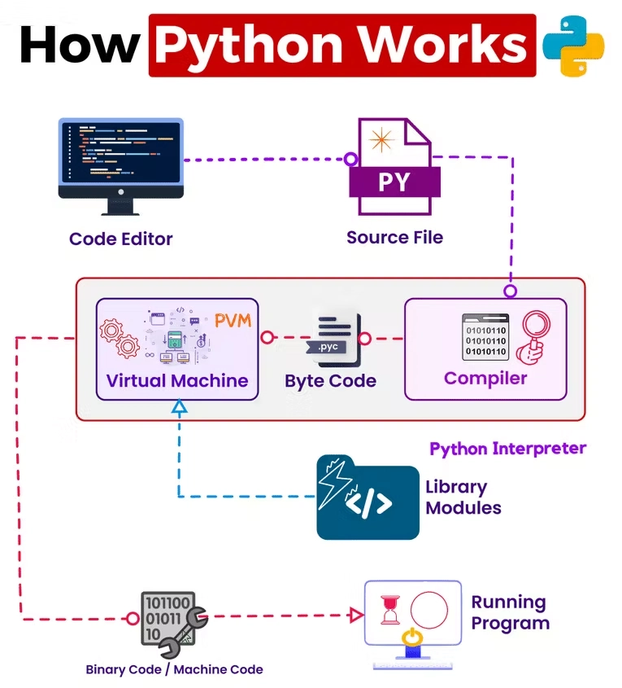

***<-----------what is PVM and also explain me what is CPython ?----------------->***

Good question 👍 Let’s break this down clearly:

---

## 🔹 What is **PVM** (Python Virtual Machine)?

* The **Python Virtual Machine (PVM)** is the runtime engine that executes Python bytecode.
* When you write a Python program, it doesn’t directly run on your CPU. Instead:

  1. Your Python source code (`.py`) is compiled into **bytecode** (`.pyc` files).
  2. That bytecode is fed into the **PVM**.
  3. The PVM is an **interpreter loop** (also called the *eval loop*) that reads each bytecode instruction and executes it in C at runtime.

👉 Think of PVM as the "engine" that powers Python execution. It’s a **software-based CPU** that interprets Python bytecode instruction by instruction.

If you’ve seen Python stack traces, the PVM is the one maintaining the *call stack*.

---

## 🔹 What is **CPython**?

* **CPython** is the **default, most widely used implementation of Python**, written in **C**.
* It includes:

  * A **compiler** (turns `.py` into `.pyc` bytecode).
  * The **Python Virtual Machine (PVM)** (executes the bytecode).
  * The **standard library** (modules like `math`, `json`, `os`, etc.).

👉 So CPython = Compiler + PVM + Standard Library.

---

## 🔹 Difference between PVM and CPython

| Aspect     | **PVM**                                 | **CPython**                                                          |
| ---------- | --------------------------------------- | -------------------------------------------------------------------- |
| Definition | The execution engine that runs bytecode | A full Python implementation (interpreter + PVM + compiler + stdlib) |
| Written in | Part of CPython, implemented in **C**   | Written in **C**                                                     |
| Scope      | Only executes bytecode                  | End-to-end implementation of Python                                  |
| Example    | Think of JVM inside Java                | Think of JDK in Java world                                           |

---

✅ In short:

* **PVM** = The engine that executes bytecode (part of CPython).
* **CPython** = The most common implementation of Python, built in C, which includes the compiler, PVM, and standard library.

---

Would you like me to also explain how **other Python implementations** (like PyPy, Jython, IronPython) differ from CPython?

***<-------------I didn't actually get what is CPython !! can you explain me a bit more in detail with building intution---------------->***
Got it 👍 You want a *deeper, intuitive* explanation of **CPython**. Let’s build it step by step, almost like peeling layers.

---

## 🟢 First, what does "Python" really mean?

When people say **“Python”**, they might mean two things:

1. The **language specification** – rules, syntax, semantics (like saying: `def hello(): print("hi")` is valid).
2. An **implementation** of that specification – some program that can actually run your Python code.

👉 Just like English is a language, and you can have different “readers” (people, text-to-speech engines, etc.) that interpret English — Python is a language, and we need an interpreter to run it.

---

## 🟢 Enter **CPython**

* **CPython is the reference implementation** of the Python language.
* It is written in **C** (hence the “C” in CPython).
* It’s what you download from [python.org](https://www.python.org/downloads/) and install on your computer.

When you type:

```bash
python mycode.py
```

you’re actually running **CPython**.

---

## 🟢 What does CPython do internally?

Think of CPython as a 3-in-1 system:

### 1. **Compiler**

* Takes your `.py` code
* Translates it into **bytecode** (`.pyc` files inside `__pycache__`)

Example:

```python
def add(a, b):
    return a + b
```

gets compiled into **bytecode** like:

```
  0 LOAD_FAST                0 (a)
  2 LOAD_FAST                1 (b)
  4 BINARY_ADD
  6 RETURN_VALUE
```

---

### 2. **Python Virtual Machine (PVM)**

* Reads this bytecode instruction by instruction.
* Actually executes them, using low-level **C functions**.
* This is the “engine” inside CPython.

---

### 3. **Standard Library**

* CPython also bundles Python’s huge standard library (`json`, `os`, `math`, etc.), which is partly written in Python and partly in C for performance.

---

## 🟢 Intuition with an Analogy

Imagine you wrote a story in English:

* The **English language** = Python language specification.
* A **translator** who knows English → French = CPython.
* The **steps**:

  * Translate your English story (Python code) into a middle form (bytecode).
  * Hand it to a **French-speaking actor** (PVM) who performs it line by line.
  * The actor also has a **toolbox of props** (standard library).

Other translators exist too:

* **Jython** → Translates Python into Java bytecode (runs on JVM).
* **IronPython** → Translates Python into .NET bytecode (runs on CLR).
* **PyPy** → Written in Python itself, with JIT for speed.

But CPython is the “official” translator and actor — the one everyone trusts.

---

✅ So, **CPython = the official interpreter of Python, written in C, that compiles your code into bytecode and runs it on the PVM, bundled with the standard library.**

---

So yes:
**👉 CPython = the interpreter of Python written in C.**

Do you want me to **show you a small demo** where we write Python code, disassemble it into bytecode, and peek at how CPython + PVM work internally?


***<----------------why is python called interpretered language and is it also a compiled langugae ?------------------->***

This is a classic confusion 😅 — let’s untangle it carefully.

---

## 🟢 Why Python is called an **interpreted language**

* When you run a Python program (`python myscript.py`):

  1. CPython **compiles** your code into **bytecode** (a lower-level, platform-independent representation).

     * This happens automatically and invisibly.
     * The bytecode often gets cached in `__pycache__` as `.pyc` files.
  2. The **Python Virtual Machine (PVM)** **interprets** that bytecode line by line (actually, instruction by instruction).

👉 The final execution step is **interpretation**, not direct execution by the CPU.
That’s why Python is called an **interpreted language**.

---

## 🟢 But is Python also a **compiled language**?

Yes, but in a **limited sense**:

* Python is **not compiled to machine code** (like C, C++ or Go).
* Instead, it is **compiled to bytecode**, which is an intermediate form.
* That bytecode is then **interpreted** by the PVM.

So:

* ✅ Python is **compiled → interpreted**.
* ❌ Python is not a **purely compiled language** like C/C++.
* ❌ Python is not a **purely interpreted language** either (because there is a compilation step).

---

## 🟢 Analogy

Think of it like this:

* C: You write a book, translate the whole book into machine-native language before anyone can read it. (Fully compiled)
* Java: You write a book, translate it into an intermediate “Java bytecode” that the JVM reads. (Compiled + interpreted/JIT)
* Python: You write a book, CPython first translates it into Python bytecode, then the PVM reads and acts out each line. (Compiled + interpreted)

---

✅ Final verdict:

* Python is **both compiled and interpreted**.
* The compilation (to bytecode) is automatic and hidden from the programmer.
* The execution step is interpretation, so we usually call Python an **interpreted language**.

---

Do you want me to show you a **real example** (using Python’s `dis` module) where we take a function and see the actual **bytecode** CPython generates before the interpreter runs it?
