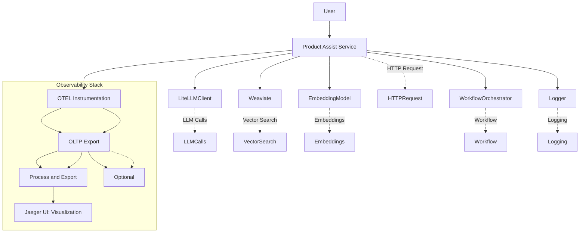

```mermaid
flowchart TD
    %% Main Components
    User --> ProductAssistService["Product Assist Service"]
    ProductAssistService --> LiteLLMClient
    ProductAssistService --> Weaviate
    ProductAssistService --> EmbeddingModel
    ProductAssistService --> WorkflowOrchestrator
    ProductAssistService --> Logger

    %% Text Annotations
    ProductAssistService -.->|"HTTP Request"| HTTPRequest
    LiteLLMClient -.->|"LLM Calls"| LLMCalls
    Weaviate -.->|"Vector Search"| VectorSearch
    EmbeddingModel -.->|"Embeddings"| Embeddings
    WorkflowOrchestrator -.->|"Workflow"| Workflow
    Logger -.->|"Logging"| Logging

    %% Observability Stack
    subgraph ObservabilityStack["Observability Stack"]
        OTELInstrumentation["OTEL Instrumentation"] --> OTELCollector
        OTELCollector --> Jaeger
        Jaeger --> JaegerUI["Jaeger UI: Visualization"]
        OTELCollector --> OtherBackends["Other Backends"]
    end

    %% Connections
    ProductAssistService --> OTELInstrumentation
    OTELInstrumentation --> OTELCollector["OLTP Export"]
    OTELCollector --> Jaeger["Process and Export"]
    OTELCollector -.-> OtherBackends["Optional"]
```