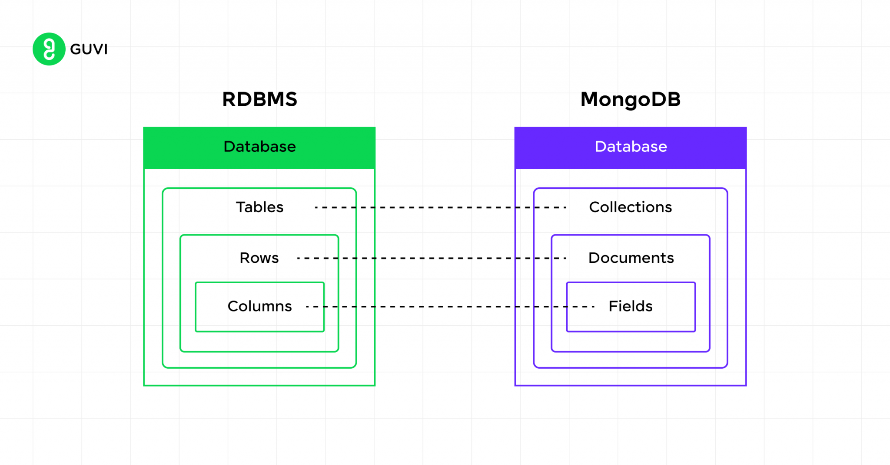

Let's map the relational database hierarchy you described (server > database > table > row > column) to the MongoDB hierarchy. MongoDB is a NoSQL document database, so its structure is different but serves analogous purposes.

Here's the MongoDB hierarchy:

1.  **MongoDB Cluster / Replica Set / Standalone Instance (Analogous to a Server)**
    * **Description:** This is the top-level deployment. It can be a single MongoDB server instance, a Replica Set (a group of servers providing high availability and data redundancy), or a Sharded Cluster (a distributed system for scaling horizontally by distributing data across multiple shards).
    * **Analogy:** This is like your "server" in the relational world, representing the entire environment where your data resides and operations are performed.

2.  **Database (Analogous to a Database)**
    * **Description:** Within a MongoDB instance or cluster, you can have multiple logical databases. Each database is an isolated collection of collections.
    * **Analogy:** This is a direct equivalent to a "database" in a relational system. You might have `admin`, `config`, `local`, and then your application-specific databases like `myAppDB`, `usersDB`, `productsDB`.

3.  **Collection (Analogous to a Table)**
    * **Description:** A collection in MongoDB is a grouping of documents. Unlike tables in relational databases, collections do not enforce a rigid schema. Documents within the same collection can have different fields, though typically documents in a single collection share a similar structure.
    * **Analogy:** This is the closest equivalent to a "table." For example, you might have a `users` collection, a `products` collection, or an `orders` collection.

4.  **Document (Analogous to a Row)**
    * **Description:** A document is the basic unit of data in MongoDB. It is a set of key-value pairs (fields) and is analogous to a row in a relational table. Documents are stored in BSON (Binary JSON) format.
    * **Analogy:** This is like a "row." Each document represents a single record or entity. For example, in a `users` collection, one document might represent a single user.

5.  **Field (Analogous to a Column)**
    * **Description:** A field is a key-value pair within a document. The value can be of various BSON data types, including strings, numbers, booleans, arrays, or even nested documents.
    * **Analogy:** This is similar to a "column." Each field represents an attribute of the document/record. For example, in a user document, you might have fields like `_id`, `name`, `email`, `age`, `address` (which could be a nested document), and `interests` (which could be an array).

### Summary Table:

| Relational Database Hierarchy | MongoDB Hierarchy                        | Description (MongoDB)                                                                                                    |
| :---------------------------- | :--------------------------------------- | :----------------------------------------------------------------------------------------------------------------------- |
| **Server** | **Cluster / Replica Set / Instance** | The top-level deployment environment where MongoDB runs.                                                                 |
| **Database** | **Database** | A logical container for collections.                                                                                     |
| **Table** | **Collection** | A group of related documents. Does not enforce strict schema.                                                            |
| **Row** | **Document** | The basic unit of data, a set of key-value pairs (fields) stored in BSON.                                              |
| **Column** | **Field** | A key-value pair within a document. Can hold various data types, including nested documents and arrays.                  |

This hierarchy provides a flexible and scalable way to store and manage data, particularly well-suited for handling semi-structured or unstructured data where a rigid schema is not always desirable.